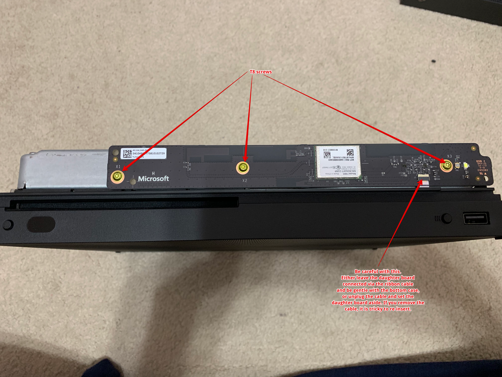
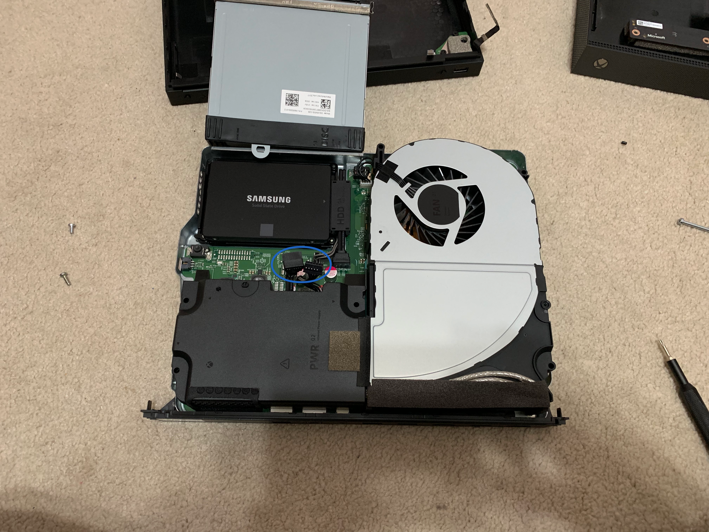

Over the weekend a friend posted an image of an error his Xbox One X has been
throwing at random times over the past couple of months. A quick Internet search
revealed the likely cause to be a bad hard drive. Of course I made the
suggestion to try and get Microsoft to replace it, but I knew that the console
was out of warranty because we both got our One X consoles at the same time
(and mine is out of warranty). So I also suggested that he could replace
the hard drive by following some [iFixit instructions][ifixit1]. Since I detest
Seagate hard drives, and SSDs were on sale, I decided to follow my own advice.

Unfortunately, the iFixit instructions are currently only for the original Xbox
One. Their [Xbox One X page][ifixit2] only has the teardown video at this time.
As I got into this process I learned a few things that are worth sharing here.
So the following is a basic summary of how to replace the hard drive in a
Xbox One X.

[ifixit1]: https://www.ifixit.com/Guide/Xbox+One+Hard+Drive+Replacement/36771
[ifixit2]: https://www.ifixit.com/Device/Xbox_One_X

## Teardown

It's a generally easy process with the One X. You only need two screw drivers
and a little patience. All screws that need to be removed are [Torx T9][t9]
screws unless otherwise noted, and then they are [Torx TR8][tr8] screws.

1. There are two screws on the back of the system to remove. One, on the right,
is covered with a small "xbox" sticker that you must peal off and discard.

2. Push the top of the case forward (rear ports are facing you) about a quarter
of an inch.

3. Slightly pull the left side of the top case away (to the left) from the
system and rotate the top of the case up and to the right. The top case is
held on by some hook tabs and this process will free it from the hooks and make
it easy to remove (and replace later).

4. At this point, you will need to remove two daughter cards that are screwed
on to the internal housing. The screws holding the daughter boards on to the
housing are TR8 screws.
<a href="01-daughter.png"></a>

5. Next we need to remove the internal components from the bottom case. This
is where the iFixit teardown video will get you into trouble. There are several
screws that _do not_ need to be removed. At this point you only need to remove
the two TR8 screws holding a ribbon cable in place (unplug the cable and
gently push over to the side) and the six screws circled in blue in the following
image. The four screws circled in green (numbered 7, 8, 9, and 10) do not need
to be removed until time to take out the hard drive.
<a href="02-top.png"></a>

6. With those screws removed you can lift the internal cage away from the
bottom case and flip it over to reveal the bottom of the cage. This will
have two screws that need to be removed. They are circled in blue and labeled
1 and 2 in the following image.
<a href="03-bottom.png"></a>

7. Now you can lift bottom half of the cage away from the top half to reveal
the fan, power supply, and BD-ROM drive. We will remove the BD-ROM drive by
lifting it up a little bit and then gently, but with quite some work, pulling
the data and power cables off the back of the drive.
<a href="04-open.png"></a>

8. The hard drive is now exposed and you can remove it by removing the 4
green circled screws on the top half of the cage as mentioned in step 5
and the power/data cables from the motherboard. Once the harddrive is free from
the cage you can remove the four screws attaching it to its tray. This will
allow you to simply pull off the cable attachment from the drive.

[t9]: https://www.ifixit.com/Store/Tools/T9-Torx-Screwdriver/IF145-087-2
[tr8]: https://www.ifixit.com/Store/Tools/TR8-Torx-Security-Screwdriver/IF145-027-4

## Cloning

This part will take a few hours. If you are upgrading to a larger hard drive,
greater than 1<acronym title="tebibyte">TiB</acronym>, then you will need to
follow some other instructions. I opted to do a 1:1 swap between a spinning
disk and a solid state drive. This means I merely needed to block copy the
old drive onto the new drive. To do so, I put both drives in a
[USB 3.0 dock][dock] connected to my Mac Mini and used [dd][dd]:

```sh
$ sudo dd if=/dev/rdisk4 of=/dev/rdisk5 bs=4m
```

> ## Important
> If you are using macOS as I did, you should use Disk Utility, GUI or CLI,
> to ***unmount*** all of the partitions from the Xbox drive that the OS
> automatically mounted when you connected it. You should also double and
> triple check that your _input_ drive (`if=`) is the Xbox drive and your
> output drive (`of=`) is your destination drive.

If you are attempting this using Windows, it looks like there are several free
utilities that can accomplish the job, but I cannot make a personal
recommendation. Whatever you use, it should be doing a block-by-block copy.
It should not be doing a "contents" copy.

Regardless of what you use to clone the original drive to the new one, it is
going to take several hours. It took about 3 for me. Once the cloning is complete
just revers all of the steps and you'll be finished.

[dock]: https://www.bestbuy.com/site/insignia-2-bay-hdd-docking-station/6153102.p?skuId=6153102
[dd]: https://en.wikipedia.org/wiki/Dd_(Unix)
